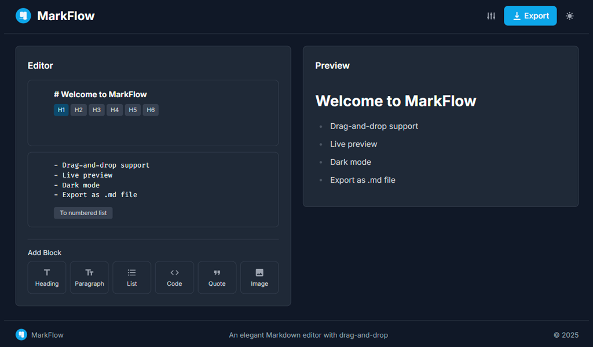

# MarkFlow

An elegant, modern Markdown editor with drag-and-drop functionality, designed for a seamless writing experience.


MarkFlow was built with ❤️ to make writing Markdown content as simple and enjoyable as possible.




## Features

- **Drag-and-Drop Editor**: Organize your content intuitively by dragging and dropping blocks
- **Live Preview**: See your changes in real-time in the preview pane
- **Dark Mode**: Protect your eyes with the built-in dark mode
- **Export Functionality**: Export your work as clean .md files
- **Fullscreen Mode**: Work without distractions in fullscreen mode
- **Responsive Design**: Works perfectly on desktop, tablet, and mobile devices
- **Accessibility**: Optimized for screen readers and keyboard navigation


## Technologies

MarkFlow is built with modern web technologies:

- **React + Vite**: For fast development and optimized builds
- **Tailwind CSS**: For consistent, responsive design
- **dnd-kit**: For the drag-and-drop functionality
- **react-markdown**: For the live preview
- **rehype-highlight**: For syntax highlighting in code blocks


## Installation

1. Clone the repository:
```bash
git clone https://github.com/your-username/markflow.git
cd markflow
```

2. Install the dependencies:
```bash
npm install
```

3. Start the development server:
```bash
npm run dev
```

4. Open http://localhost:3000 in your browser.


## Usage

- **Add Blocks**: Use the toolbar at the bottom of the editor to add new blocks
- **Edit Blocks**: Click on any block and start editing
- **Rearrange Blocks**: Drag blocks by the handle (left side) to a new position
- **Toggle Preview**: Use the eye icon in the header
- **Export**: Click the export button to save your work as a .md file


## Contributing

Contributions are welcome! Please open an issue or pull request if you'd like to suggest improvements.


## License

This project is licensed under the MIT License - see the LICENSE file for details.

MIT © 2025 MarkFlow
See [LICENSE](./LICENSE) for details.
